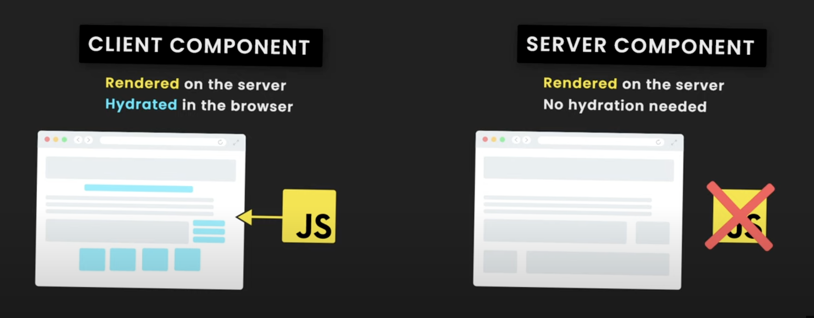

# Next.js 13

New to 13: Server componenets that are rendered on the server. Before, everything was a client component and required "hydration" in the browser. In Next13, components are Server Components by default. Server Components cannot contain any JS (e.g. `onClick` events and React hooks like `useState`), meaning that they can be rendered as static HTML on the server and served as a fully rendered component to the user, without the need for JS hydration (the fetching of the React JavaScript from the browser once the HTML and CSS has rendered). That means the overall size of the JS being served to the browser is less, leading to (hopefully) better performance. How is it less? Because now, not all components require hydration/JS. And when I say JS here, I mean JS that runs on the browser. Server Components can contain server-side Node JavaScript that runs per request (but they don't have to and can be served statically -- preferred as FAST).

But you'll still need client components for:

- State
- Client effects
- Client router
- Interective events, e.g. Click events

What could we use server comps for?

- Fetching data
- Using sensitive info, like access keys, api tokens -- a they need to be hidden from frontend
- Keeping large JS packages on the server (less sent to client = better performance)

Server components require no additional JS to be fetched on the browser, reducing JS and increasing performance. Can fetch data directly, use api keys etc. Problem: if you need interactivity, you need to use client component. But, you can just use client comps for the sections of pages that need to be interactive. Can also cache client and server components, like in /pages folder previously.



## More info on Hydration

Hydration: static site generation, where HTML + CSS is rendered at build time and put on the server or CDNs ("Server Rendering"). A link to JS is also sent to hydrate the page and make it interactive -- result: fast initial load plus super interactive fast app feel of a React App once page is hydrated.

Dan Abramov writes it as: “It's like watering the “dry” HTML with the “water” of interactivity and event handlers.”

The server sends the client HTML along with a link to the JS to download. The JS gets downloaded and then “hydrates” the page taking it from a plain page to one with interactivity meaning adding handlers to buttons, events to elements on the page like onClick and so forth.

The idea of hydration is that it lets you start with a completely rendered page, then it makes that rendered page "work".

A data table makes the best example of this. The static HTML provides page 1 with the "page numbers" at the bottom, then the javascript comes up and makes that all work. It also might update the page 1 invisibly with new info if the data changed after the initial rendering.

This compares to "classic SSR" where the server is responsible for rendering pages entirely, or the classic CSR (client-side rendering) method where the client gets a bunch of react code and (presumably) json data and renders the page. Classic CSR (think "create-react-app") involves the client downloading a JavaScript bundle that builds the page entirely in the browser. The client renders the UI and fetches data (like JSON), and the HTML sent by the server is minimal or often just a blank page (with a script tag for the JavaScript to take over) -- this allows our pages to be super interactive and react easily to events, but bad for SEO as crawlers have a hard time crawling client-rendered content + bigger load times in the browser, as everything is rendered there (big JS bundle).

Static page + Hydration is great for SEO as HTML and CSS are loaded as static pages, with a link to the JS to be fetched to make the page interactive. So, the "First Contentful Paint" is good, but the "Time to Interactive" delayed. But then the app should behave like a CSR app (super fast when clicking between links) -- so, it's react with good initial load speed due to serving up the static html before hydrating with JS, but the hydration makes for a super fast experience as e.g. js for links to other pages pre-fetched.

## NEW: App Directory

In the old "pages" dir, we could only make client components. In the new "app" dir, we can make server and client components.

## NEW: Streaming and suspense

Stream content to the browser using Suspense boundaries in pages. So, if we are fetching some data to display on one section of a page, rather than showing a loading icon for the whole page, we can serve up the rest of the page first, and only show a loading message in this single sub component and not block the rest of the page from loading. We don't block the rest of the page from reaching the browser while that fetch is ongoing.


## Nextjs 13 approach

Use server components wherever possible, and for smaller pieces of interactive UI, sprinkle in client components. Componets are by default Server Components.

## Static Rendering vs Dynamic Rendering

Static rendering = static site generation (SSG), generating pages at build time so can be distributed via CDN and FAST. But some pages need to be dynamic and run on the server at request time. E.g.:

```js
const res = await fetch(`http://localhost:4000/tickets/${id}`, {
  next: {
    revalidate: 60, // cache result for all users for 60 secs. This page can be redistributed to a CDN during each caching period for FAST response. If this was 0, then no caching and page is ALWAYS dynamically rendered.
  }
}
```

These pages will be cached GLOBALLY, so every user will see the same page.

### When would caching be "per user"??

For caching to work on a per-user basis, you would need to include user-specific data in the request, such as:

- Authentication tokens (e.g., sending a JWT or a session token).
- Querying for data that depends on the logged-in user's ID or preferences.
- Fetching personalized content for the user.

To handle user-specific data, you would usually include logic in your fetch request or context that ties the data to individual users. For instance:

```js
const res = await fetch("http://localhost:4000/tickets", {
  headers: {
    Authorization: `Bearer ${userToken}`, // Personalized token for user
  },
  next: {
    revalidate: 0, // Disable caching or use private caching for per-user
  },
});
```

In this case, the request is personalized to the user based on their token, and you might want to turn off global caching (revalidate: 0) to avoid caching responses globally. This would make the data fetching per-user rather than globally cached.

## Streaming and Suspense

Wrap a component in <Suspense>. This allows Nextjs to stream parts of a page to the browser while any data fetching is going on in the background.

When you define a layout or a page using Server Components (which is the default), Next.js uses <Suspense> to handle async data fetching and loading states gracefully. The framework allows pages to use concurrent rendering and suspense-based data fetching.

This means if a page or layout has asynchronous code (like fetch()), Next.js will wait for the data to resolve and suspend the rendering while optionally showing a loading indicator. So, Next.js wraps pages (if they are Server Comps) with <Suspense> automatically if they contain async code.

## I asked ChatGPT: Next.js suspense. if a component is wrapped in suspense, are other parts of the page rendered statically and concurrently?

When using Next.js with React's Suspense, here's how the behavior works regarding static rendering and concurrent rendering:

**Key Concepts**
Static Rendering: Parts of your page that do not depend on data fetching or dynamic updates can be pre-rendered at build time (SSG) or on demand (ISR).

Concurrent Rendering: This allows React to work on rendering multiple components without blocking the entire UI. If a component is "suspended" (e.g., waiting for some data), React can still render other parts of the page, then fill in the suspended part when ready.

**Behavior of Suspense in Next.js**

1. **Page Parts Outside Suspense**:

These are rendered as soon as possible—either statically (SSG), server-side (SSR), or client-side depending on how the page/component is configured.

This means other parts of the page can render concurrently without waiting for the suspended component to resolve.

2. **Page Parts Inside Suspense**:

The content inside a Suspense boundary waits until the data it depends on becomes available (like a data-fetching promise resolving).

Until the component inside the Suspense boundary is ready, React shows the fallback UI (e.g., a spinner or a placeholder).

**How Next.js Handles This**

**Concurrent Rendering**: With Suspense, React allows different parts of the page to render **in parallel**. Other components (outside the Suspense boundary) do not block the rendering of the entire page.

**SSR/SSG with Suspense**: If you use Suspense with server-side data fetching (getServerSideProps) or static rendering (getStaticProps), Next.js ensures that the server resolves everything required before sending the final HTML. The client doesn't need to wait—everything is sent ready to render.

In SSR, the whole page waits for all necessary data, so the benefit of Suspense in SSR mode is more about rendering performance in React, not the server-side speed.

**Client-side Suspense**: If a component wrapped in Suspense fetches data client-side, other parts of the page will render immediately, and the Suspense fallback is shown while the fetching occurs.

## npm run build

Will show you on the terminal which pages are:

○ (Static) prerendered as static content
● (SSG) prerendered as static HTML (uses getStaticProps)
ƒ (Dynamic) server-rendered on demand

`npm run start` will run the build and give more production-like performance than the dev server.
